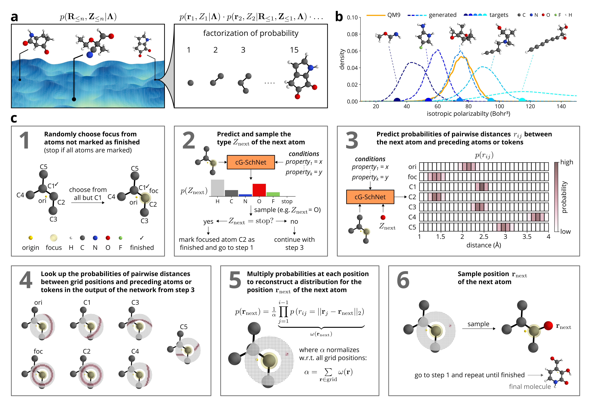

# cG-SchNet

Implementation of cG-SchNet - a conditional generative neural network for 3d molecular structures - accompanying the paper [_"Inverse design of 3d molecular structures with conditional generative neural networks"_](https://arxiv.org/abs/2109.04824).
If you are using cG-SchNet in your research, please cite the corresponding paper:

N.W.A. Gebauer, M. Gastegger, S.S.P. Hessmann, K.-R. Müller, and K.T. Schütt. Inverse design of 3d molecular structures with conditional generative neural networks. arXiv preprint arXiv:2109.04824.

    @article{gebauer2021inverse,
    title={Inverse design of 3d molecular structures with conditional generative neural networks},
    author={Gebauer, Niklas WA and Gastegger, Michael and Hessmann, Stefaan SP and M{\"u}ller, Klaus-Robert and Sch{\"u}tt, Kristof T},
    journal={arXiv preprint arXiv:2109.04824},
    year={2021}
    }

The code provided in this repository allows to train cG-SchNet on the tasks presented in the paper using the QM9 data set which consists of approximately 130k small molecules with up to nine heavy atoms from fluorine, oxygen, nitrogen, and carbon.

### Requirements
- schnetpack 0.3
- pytorch >= 1.2
- python >= 3.7
- ASE >= 3.17.0
- Open Babel 2.41
- rdkit >= 2019.03.4.0

In the following, we describe the setup using Anaconda.

The following commands will create a new conda environment called _"cgschnet"_ and install all dependencies (tested on Ubuntu 18.04 and 20.04):

    conda create -n cgschnet python=3.7 pytorch=1.3.1 torchvision cudatoolkit=10.1 ase=3.19.0 openbabel=2.4.1 rdkit=2019.09.2.0 -c pytorch -c openbabel -c defaults -c conda-forge
    conda activate cgschnet
    pip install 'schnetpack==0.3'
    
Replace _"cudatoolkit=10.1"_ with _"cpuonly"_ if you do not want to utilize a GPU for training/generation. However, we strongly recommend to use a GPU if available.

To observe the training progress, install tensorboard:

    pip install tensorboard

# Getting started
Clone the repository into your folder of choice:

    git clone https://github.com/atomistic-machine-learning/cG-SchNet.git

### Training a model
A model conditioned on the composition of molecules and their relative atomic energy with the same settings as described in the paper can be trained by running gschnet_cond_script.py with the following parameters:

    python ./cG-SchNet/gschnet_cond_script.py train gschnet ./data/ ./models/cgschnet/ --conditioning_json_path ./cG-SchNet/conditioning_specifications/4_comp_relenergy.json --split_path ./cG-SchNet/splits/4_comp_relenergy_split.npz --cuda

The training data (QM9) is automatically downloaded and preprocessed if not present in ./data/ and the model will be stored in ./models/cgschnet/.
We recommend to train on a GPU but you can remove _--cuda_ from the call to use the CPU instead. If your GPU has less than 16GB VRAM, you need to decrease the number of features (e.g. _--features 64_) or the depth of the network (e.g. _--interactions 6_).
The conditioning network is specified in a json-file. We provide the settings used in experiments throughout the paper in ./cG-SchNet/conditioning_specifications. The exact data splits utilized in our trainings are provided in ./cG-SchNet/splits/. The conditioning network and corresponding split are numbered like the models in Supplementary Table S1, where we list the hyper-parameter settings. Simply replace the paths behind the _--conditioning_json_path_ and _--split_path_ arguments in order to train the desired model.
If you want to train on a new data split, remove _--split_path_ from the call and instead use _--split x y_ to randomly create a new split with x training molecules, y validation molecules, and the remaining molecules in the test set (e.g. with x=50000 and y=5000).

The training of the full model takes about 40 hours on a A100 GPU. For testing purposes, you can leave the training running for only a couple of epochs. An epoch should take 10-20 min, depending on your hardware. To observe the training progress, use TensorBoard:

    tensorboard --logdir=./models
    

The logs will appear after the first epoch has completed.

### Generating molecules
Running the script with the following arguments will generate 1000 molecules using the composition C7O2H10 and relative atomic energy of -0.1 as conditions using the trained model at ./model/cgschnet/ and store them in ./model/cgschnet/generated/generated.mol_dict:

    python ./cG-SchNet/gschnet_cond_script.py generate gschnet ./models/cgschnet/ 1000 --conditioning "composition 10 7 0 2 0; n_atoms 19; relative_atomic_energy -0.1" --cuda

Remove _--cuda_ from the call if you want to run on the CPU. Add _--show_gen_ to display the molecules with ASE after generation. If you are running into problems due to small VRAM, decrease the size of mini-batches during generation (e.g. _--chunk_size 500_, default is 1000).

### Filtering and analysis of generated molecules
After generation, the generated molecules can be filtered for invalid and duplicate structures by running filter_generated.py:

    python ./cG-SchNet/filter_generated.py ./models/cgschnet/generated/generated.mol_dict --train_data_path ./data/qm9gen.db --model_path ./models/cgschnet
    
The script will print its progress and the gathered results.
The script checks the valency constraints (e.g. every hydrogen atom should have exactly one bond), the connectedness (i.e. all atoms in a molecule should be connected to each other via a path over bonds), and removes duplicates*. The remaining valid structures are stored in an sqlite database with ASE (at ./models/cgschnet/generated/generated_molecules.db) along with an .npz-file that records certain statistics (e.g. the number of rings of certain sizes, the number of single, double, and triple bonds, the index of the matching training/test data molecule etc. for each molecule).

*_Please note that, as described in the paper, we use molecular fingerprints and canonical smiles representations to identify duplicates which means that different spatial conformers corresponding to the same canonical smiles string are tagged as duplicates and removed in the process. Add '--filters valence disconnected' to the call in order to not remove but keep identified duplicates in the created database._

### Displaying generated molecules
After filtering, all generated molecules stored in the sqlite database can be displayed with ASE as follows:

    python ./cG-SchNet/display_molecules.py --data_path ./models/cgschnet/generated/generated_molecules.db

# How does it work?

cG-SchNet is an autoregressive neural network. It builds 3d molecules by placing one atom after another in 3d space. To this end, the joint distribution of all atoms is factorized into single steps, where the position and type of the new atom depends on the preceding atoms (Figure a). The model also processes conditions, i.e. values of target properties, which enable it to learn a conditional distribution of molecular structures. This distribution allows targeted sampling of molecules that are highly likely to exhibit specified conditions (see e.g. the distribution of the polarizability of molecules generated with cG-SchNet using five different target values in Figure b). The type and absolute position of new atoms are sampled successively, where the probability of the positions is apporximated from predicted pairwise distances to preceding atoms. In order to improve the accuracy of the approximation and steer the generation process, the network uses two auxiliary tokens, the focus and the origin. The new atom always has to be a neighbor of the focus and the origin marks the supposed center of mass of the final structure. A scheme explaining the generation procedure can be seen in Figure c. It uses 2d positional distributions for visualization purposes. For more details, please refer to the publication [_here_](https://arxiv.org/abs/2109.04824).

